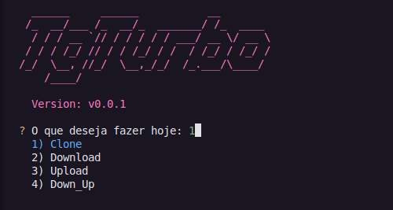

TgTurbo

# TgTurbo

TgTurbo é um projeto desenvolvido para facilitar a manipulação de mídias em plataformas de mensagens. Este projeto visa otimizar a experiência do usuário ao interagir com arquivos de mídia.



## Índice

- [Instalação](#instalação)
- [Uso](#uso)
- [Funcionalidades](#funcionalidades)
- [Opções do Usuário](#opções-do-usuário)
- [Contribuição](#contribuição)
- [Licença](#licença)

## Instalação

Para instalar o TgTurbo, siga os passos abaixo:

1. Clone o repositório:
   ```bash
   git clone https://github.com/seu_usuario/TgTurbo.git
   ```
2. Navegue até o diretório do projeto:
   ```bash
   cd TgTurbo
   ```
3. Instale as dependências:
   ```bash
   pip install -r requirements.txt
   ```

## Uso

Para utilizar o TgTurbo, execute o seguinte comando:

```bash
python main.py
```

Siga as instruções na tela para realizar o download ou upload de mídias.

## Funcionalidades

- Download de mídias de plataformas de mensagens.
- Upload de mídias para plataformas de mensagens.
- Reenviar mídias para plataformas de mensagens.
- Suporte a múltiplos formatos de arquivo.
- Interface de linha de comando amigável.

## Opções do Usuário

Ao iniciar o TgTurbo, você verá um menu com as seguintes opções:

1. **Clone**: Copia mídias de um chat para outro. Você precisará inserir o ID do chat de origem e o ID do chat de destino.
2. **Download**: Faz o download de mídias de um chat. Você precisará inserir o ID do chat de origem.
3. **Upload**: Faz o upload de mídias para um chat. Você precisará inserir o caminho da pasta onde as mídias estão localizadas.
4. **Down_Up**: Realiza tanto o download quanto o upload de mídias. Você precisará inserir o ID do chat para baixar e o ID do chat para enviar.

Após selecionar uma opção, você será solicitado a confirmar sua escolha antes de prosseguir.

## Contribuição

Contribuições são bem-vindas! Sinta-se à vontade para abrir um pull request ou relatar problemas.

1. Faça um fork do projeto.
2. Crie uma nova branch (`git checkout -b feature/nome-da-sua-feature`).
3. Faça suas alterações e commit (`git commit -m 'Adicionando uma nova feature'`).
4. Envie para o repositório remoto (`git push origin feature/nome-da-sua-feature`).
5. Abra um pull request.

## Licença

Este projeto está licenciado sob a Licença MIT. Veja o arquivo [LICENSE](LICENSE) para mais detalhes.
